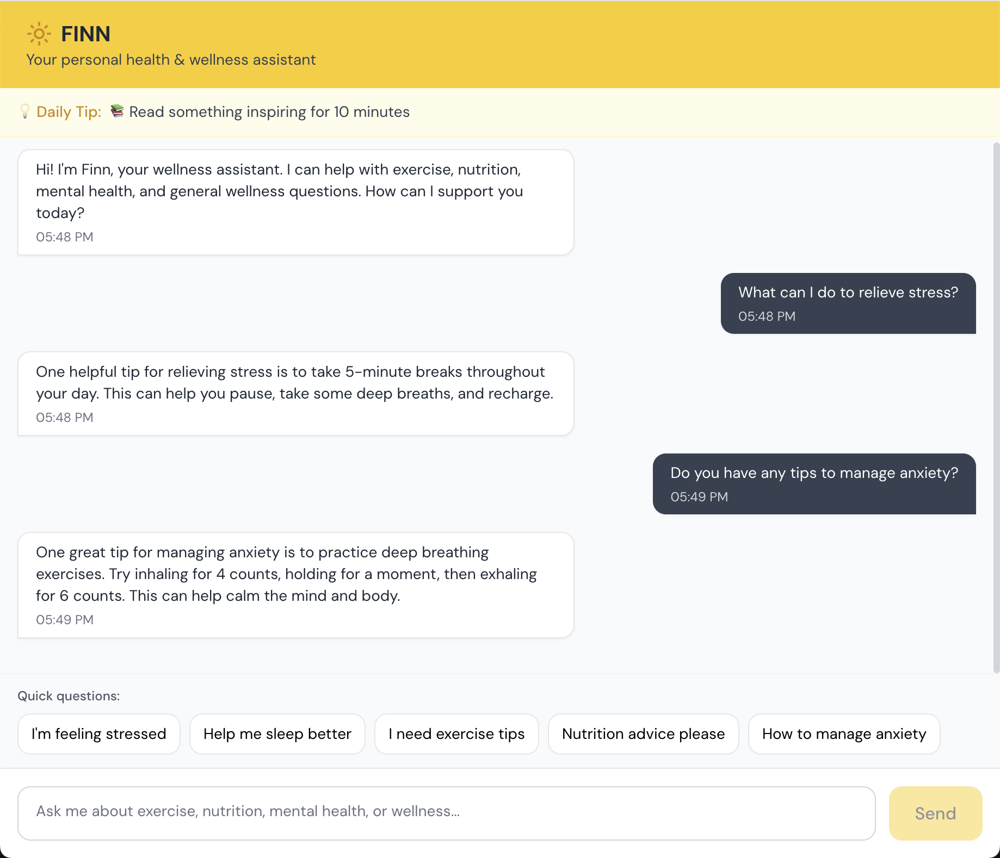

# Finn - AI Wellness Bot

A friendly AI-powered wellness chatbot that provides personalized advice on exercise, mental health, nutrition, sleep, and stress management.



## ⚡ Key Features

- **Intelligent Wellness Guidance:** Uses Claude AI with custom knowledge base to provide wellness advice
- **Daily Wellness Tips:** Rotating wellness tips to encourage healthy habits
- **Quick Question Selection:** Pre-built common questions for faster interaction
- **Friendly Conversational Interface:** Natural chat experience with clean design
- **Scope Management:** Gracefully redirects non-wellness questions
- **Responsive Design:** Optimized for desktop with mobile compatibility
- **Token-Optimized:** Efficient API usage for cost-effective operation

## 🛠️ Tech Stack

- **Backend:** Node.js, Express, JavaScript
- **Frontend:** React, JavaScript, Vite, Tailwind CSS
- **APIs:** Anthropic Claude API

## Getting Started

1. **Set up the backend**

   ```
   cd backend
   npm install

   # Create environment file
   echo "PORT=3001" > .env
   echo "ANTHROPIC_API_KEY=your_api_key_here" >> .env
   echo "NODE_ENV=development" >> .env
   ```

2. **Set up the frontend**

   ```
   cd frontend
   npm install
   ```

3. **Run the application**

   ```
   # Start backend (runs on http://localhost:3001)
   cd backend
   npm start

   # Start frontend (runs on http://localhost:5173)
   cd frontend
   npm run dev
   ```

4. **Open your browser**

   Navigate to http://localhost:5173 and start chatting!

## API Routes

- `GET /api/health` - Server health check
- `POST /api/chat` - Send message, receive wellness advice

## Future Enhancements

- **Conversation Context:** Remember previous messages for better follow-ups
- **Enhanced Quick Replies:** Expanded common questions and smart suggestions
- **User Accounts:** Secure authentication with conversation history
- **Progress Tracking:** Wellness goal setting and monitoring
- **Mobile Optimization:** Enhanced mobile user experience
